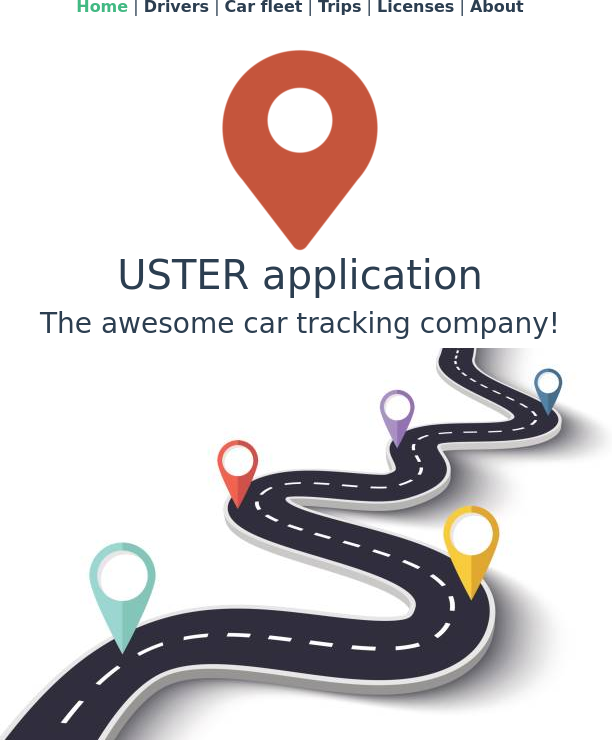
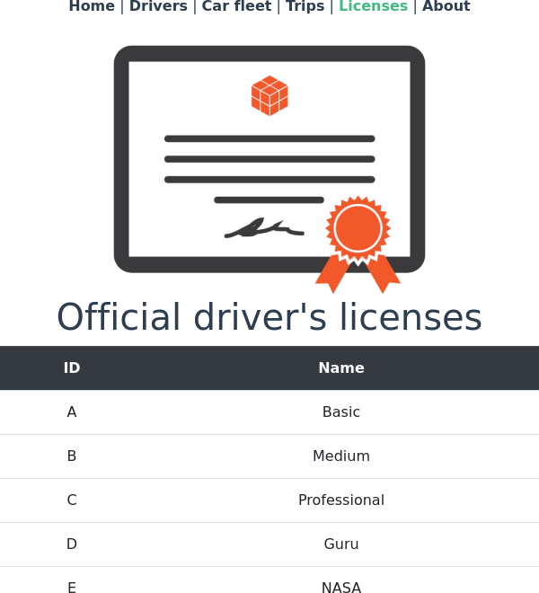
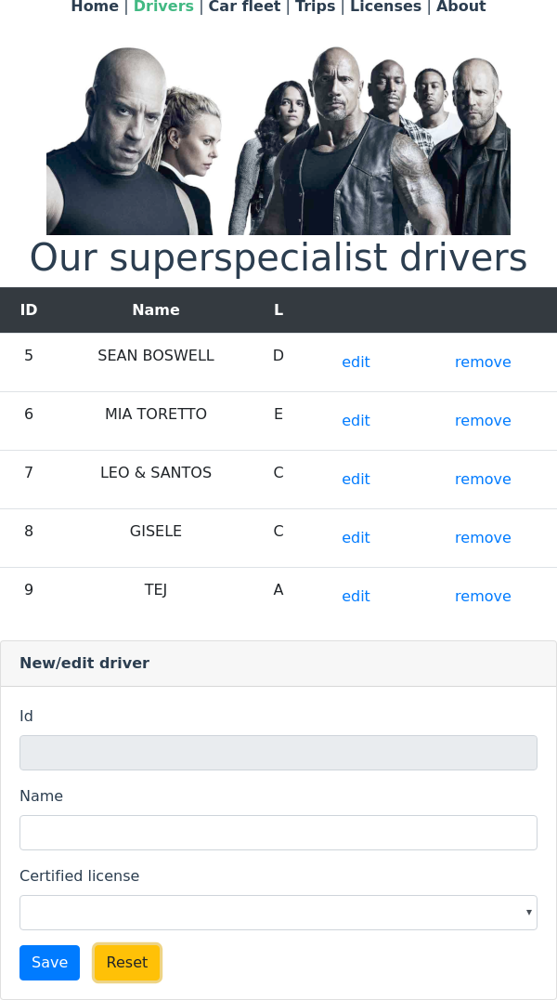
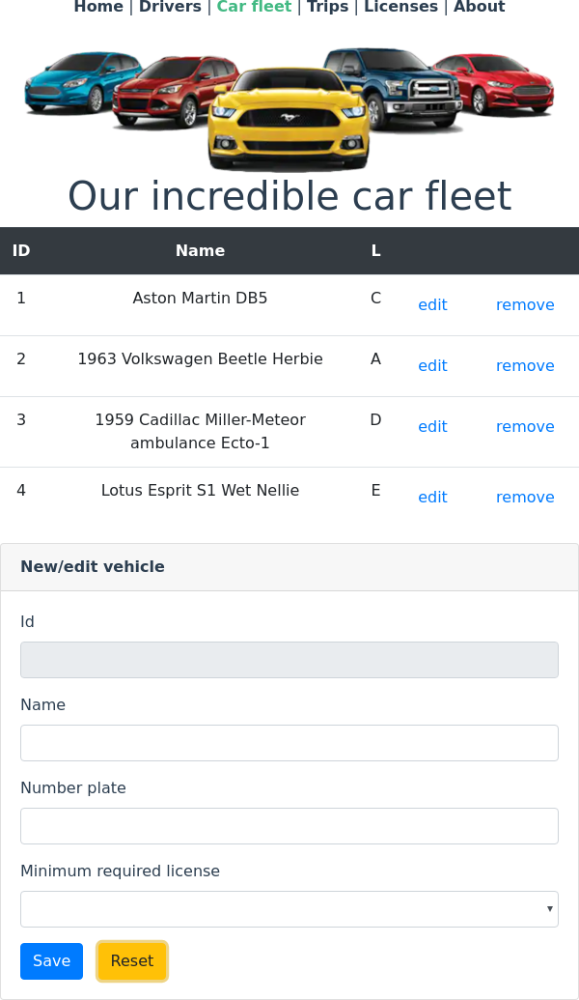
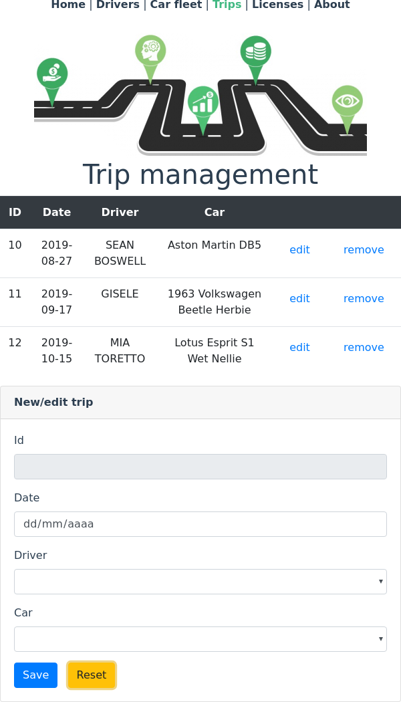
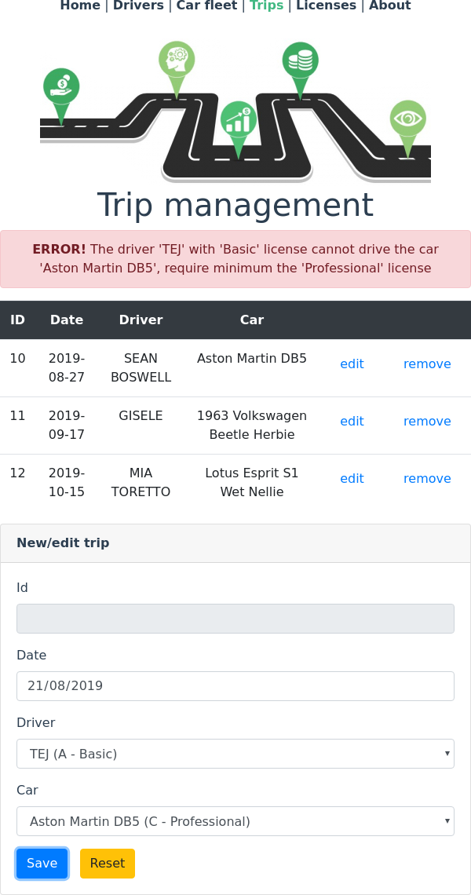
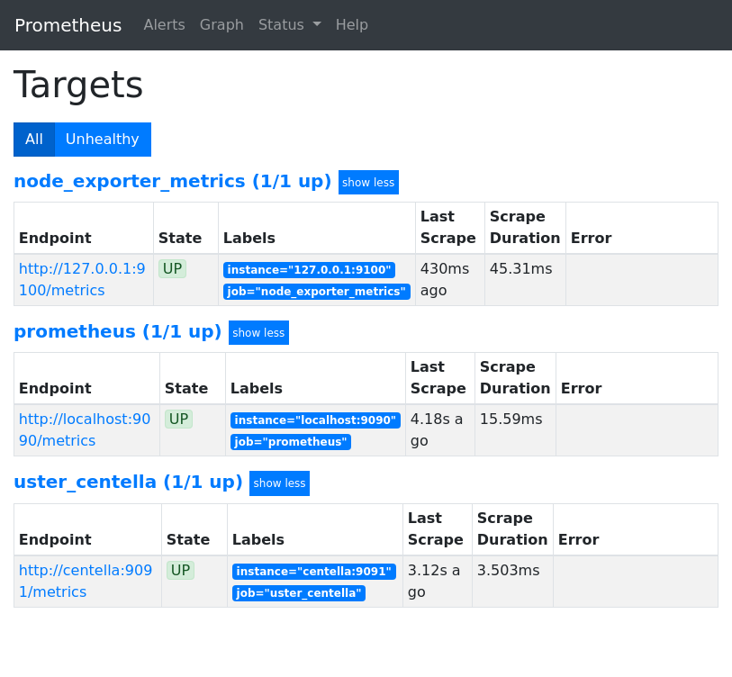
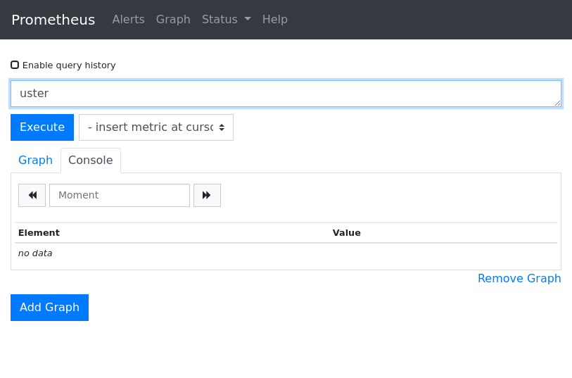
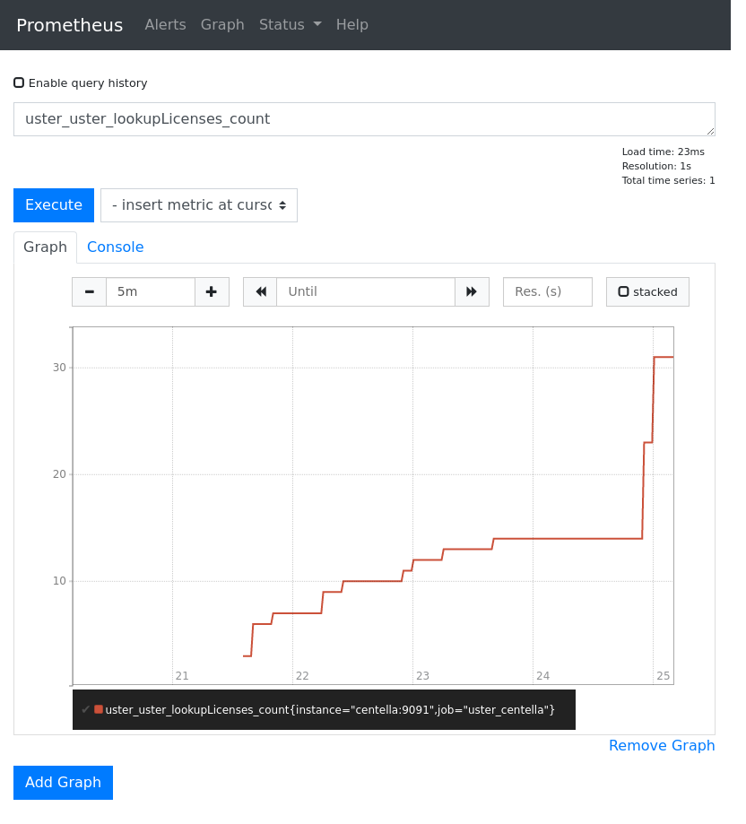

# Uster

## Why?

The human resources department often asks us for help in evaluating candidates.
Quite a few of them get evaluations below expectations. Why?

In order to be more objective in my evaluations (trying to readjust my personal bias),
I decided to do the test myself.

Here it is.

(I don't expect candidates to do a job like mine. If they do the same or better
it would be great, of course. The idea is to be able to identify what a candidate
thinks when he is taking the test and therefore his abilities)

## Introduction

Estimated dedicated time to this pet project: 4h + 2h + 2h + 1h + 2h + 2h + 1h + 1h.

You will see overengineering in this pet project but the goal is not to make a
CRUD of three entities (vehicles, drivers and trips) but to show different
strategies and technologies. Some of them could be done in many ways (eg. get
metrics for each transaction could be done automatically using JMX instead
coded into `business` with pros and cons).

## Packages

* `datamodel`, contains _POJO_ data classes.
* `backend`, abstract the access to certain pure data backend.
* `backend-default`, implement `backend` as a fake backend.front web

* `backend-hibernate`, agnostic database backend implementation.
* `business`, central access point (the core) to the **Uster** platform.
* `metrics`, decouple monitorization over the platform.
* `metrics-stdout`, simple `metrics` implementation to _stadout_.
* `metrics-prometheus`, implement `metrics` using **Prometheus**.
* `rest-server`, it expose the `business` through a rest api service.
* `web-ui`, web front using `vue client`.

## Main application aspects

* no *DI* framework, using explicit dependency injection.
* no user roles defined at core level (`business`), decoupled auth subsystem.
* written for clarity/simplicity before performance.
* no checked exceptions, all failures go directly to each client.
* agnostic and immutable data model, certain mappings have had to be done (eg. hibernate code first model).
* **NO AUTHENTICATION** implemented, instead couple the main core (`business`) to certain authentication model (orthogonal to the platform),
I decide to not support authentication explicitly (eg. the `rest-server` could be secured using basic auth over https at http server level or so).
* documented web api interfaces (swagger)

## Interesting questions that have arisen

* **DI** (of course)
* **UI** frameworks to use (of course)
* **js** ecosystem sucks (of course)
* abstraction vs coupling level (eg. one data model vs domain specific data models; eg. immutable data models using lombok's `@Value` force to
add private constructor when using with `jackson`)
* tests overlapping, test integration under multiple implementations
* metrics: push vs pull problem
* authentication is an orthogonal platform aspect but may be strongly coupled with some business aspects (authorization). The solution is not
only use _OAuth_ (the usual adopted solution for web based apps) but a more general solution like **LDAP**.
* chunked responses using **application/xml** is not well supported (using **application/json** it is).
* internationalization (formats, translations, ...) not done.
* user interface error report and control.
* web user interface (`vue.js`) use an automatic generated client from swagger specifications.
* *UX* testing, not done.
* TODO: system load control, DoS, ...

## Curiosities

* the `Backend` contains *abstract* generic tests used for all specific implementations.
* the `Business` run the same tests under the cross product between all backend and metrics implementations.
* the *CRUD* implementation for *Hibernate* is done generically (only one for all entities).
* trying **WPA** concept (under `vue`)

## Questions not related to this pet project but coming to mind

* services interoperability
* message queues
* distributed caches
* distributed configurations
* failover

## Setup

### Prometheus

* our client implementation run a pull server on the **0.0.0.0:9091** port.

### rest-server

* our rest server implementation force as default the **0.0.0.0:9092** port.
* http://localhost:9092/v2/api-docs swagger documentation
* http://localhost:9092/swagger-ui.html swagger-ui interface
* run from project `./gradlew clean :rest-server:bootRun`

### web-ui

* using *"vue client"*
* run with `npm run server`

### Java apps

* all long runtime applications up their own **glowroot** servers
* all long runtime applications up their own prometheus **JMX** agents

## Screenshots

### ============== Home ==============

### ============== About ==============

### ============== Licenses ==============

### ============== Drivers ==============

### ============== Carfleet ==============

### ============== Trips ==============

### ============== Error handling ==============

### ============== Prometheus ==============

## UPDATES

### 2019 november

- [x] Docker rest-server image
- [x] kubernetes namespace and rest-server deploy
- [ ] Docker Prometheus image
- [ ] Docker web-ui (nginx) image
- [ ] Docker db image
- [ ] maybe another nginx image (the front)
- [ ] connect using kubernetes yaml
